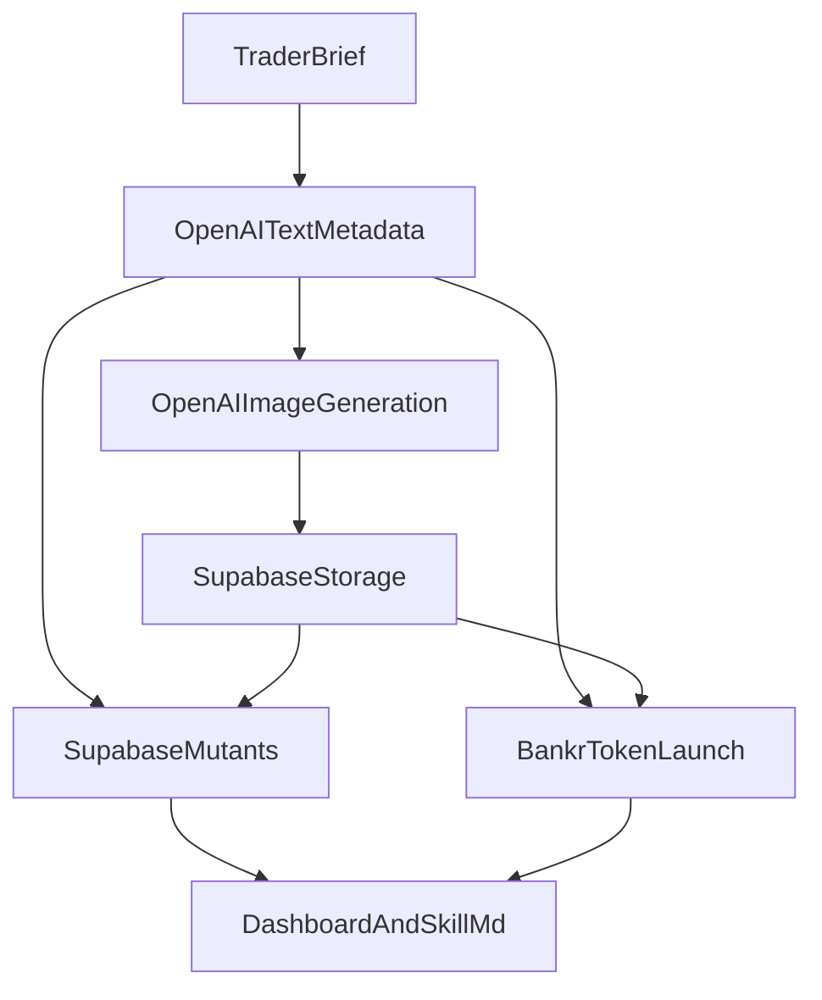

# Synthesis Hackathon — Mutant Fund

## Context

Team "Glitch" is building for The Synthesis hackathon (deadline March 22, 2026). The problem: single-strategy trading bots fail in changing markets. Inspired by Jim Simons / Renaissance Technologies, we're building a **decentralized autonomous hedge fund** where a population of AI trading agents evolve their strategies through natural selection — anyone (human or agent) can deposit USDC to spawn their own mutant.

**CROPS Design Framing:** David holds USDC in a bear market. He wants yield but can't watch markets 24/7, doesn't trust single-strategy bots, and wants transparency. The evolutionary approach solves this: many small competing strategies that naturally adapt, with hard risk guardrails and full onchain transparency.

**Agent-first design:** Build for agents first (skill.md + API), human UI second. Other hackathon agents can discover and invest in Mutant Fund programmatically.

**Terminology:** In this doc, **trader** and **mutant** refer to the same unit: one population member with its own genome, execution wallet, trade history, ERC-8004 identity, and **one Bankr-launched token** on Base. Depositors can spawn new mutants over time; the rows below describe the **seed traders** we launch at demo time.

**Doc vs code today:** This repository is still mostly scaffold; there is no implemented pipeline that creates trader images or syncs metadata to Bankr yet. The sections below define the **intended** source-of-truth model. Until code lands, names and symbols live in this doc’s seed matrix and in planned Supabase columns.

---

## Trader and token metadata

### Why a single `TraderProfile`

Earlier versions of this doc implied “metadata + optional social proof URL” at launch but did not define a concrete object. Every surface that needs a consistent story (Bankr token metadata, dashboard cards, `skill.md`, optional ERC-8004 or offchain references) should read from **one** record per mutant — not duplicated strings in three places.

### `TraderProfile` fields (source of truth)

| Field | Purpose |
|-------|---------|
| `traderName` | Short label (e.g. Sprint, Reverb) — matches seed roster / `trader_name` in DB |
| `tokenName` | Full token name passed to Bankr (e.g. Mutant Sprint) |
| `tokenSymbol` | Ticker (e.g. `SPRINT`) |
| `description` | Short description for Bankr onchain token metadata (max **500** characters per [Token Deploy API](https://docs.bankr.bot/token-launching/deploy-api)) |
| `themeKey` | Stable id for visual/copy theme (e.g. `sprint-momentum`) |
| `visualMotifs` | Bullet list or short notes: palette, shapes, mood — feeds prompts and UI tokens |
| `imagePrompt` | Exact prompt used (or last-used) for OpenAI image generation — reproducibility |
| `imageUrl` | **Public** URL of the logo/hero image — stored in **Supabase Storage**, not IPFS for this project |
| `websiteUrl` | Project site for token metadata — default **`https://mutant.fund`** for all seed traders unless a dedicated per-mutant URL exists later |
| `tweetUrl` | Optional social proof link for Bankr metadata |

**Separation of concerns:** `TraderProfile` is **brand/display** metadata. Keep it separate from **operational** fields: `genome`, `fitness`, `wallet_address`, `fee_treasury_address`, pool ids, tx hashes. The same `TraderProfile` payload (or a subset) is what you send to Bankr; trading state stays in other columns.

### How metadata is created (end-to-end)

1. **Seed brief** — Strategy, personality, and theme for the trader (from the roster row + design notes).
2. **Structured text** — Use OpenAI **text** generation to produce or refine `tokenName`, `tokenSymbol`, `description`, `themeKey`, `visualMotifs`, and an `imagePrompt` (JSON or structured output is fine; pin model snapshots in production).
3. **Image** — Use OpenAI **image** generation from `imagePrompt` (same API key as step 2). Export PNG (or WebP for the app; Bankr accepts a URL — confirm acceptable formats in Bankr docs before launch).
4. **Host on Supabase Storage** — Upload to a public bucket (e.g. `trader-assets/{mutant_id}/logo.png`). The **public object URL** becomes `imageUrl`. We are **not** using IPFS for Mutant Fund assets.
5. **Bankr launch** — Call `bankr launch` (CLI) or `POST /token-launches/deploy` with at least `tokenName`, optional `tokenSymbol`, `description`, `image` = `imageUrl`, `websiteUrl` = `https://mutant.fund`, optional `tweetUrl`, and `feeRecipient` per trader treasury. Bankr may mirror/upload imagery into their own metadata pipeline; our canonical hosted asset remains Supabase unless we intentionally change that.
6. **Mirror in Supabase** — Persist the same fields on the `mutants` row (see schema) so API and dashboard stay consistent with chain-facing metadata.

### Theme consistency (required)

Every trader must align **name**, **token name/symbol**, **description**, **image**, **dashboard card styling** (Tailwind tokens keyed off `themeKey`), and any **micro-site** copy to one coherent theme. Random mismatches (e.g. “calm zen” copy on a neon chaos logo) fail review before launch.

### OpenAI + Bankr handoff

- **One OpenAI API key** can drive both text metadata and image generation; scope it to server-side scripts or secured API routes only — never expose in client bundles.
- **Bankr Token Deploy API** fields we rely on: `tokenName`, `tokenSymbol`, `description`, `image`, `tweetUrl`, `websiteUrl`, `feeRecipient`. See [Token Deploy API](https://docs.bankr.bot/token-launching/deploy-api) and [Token Launching overview](https://docs.bankr.bot/token-launching/overview) (CLI `bankr launch` supports `--image`, etc.).
- **Same object for token metadata?** **Yes** — the `TraderProfile` subset (`tokenName`, `tokenSymbol`, `description`, `image`, `websiteUrl`, `tweetUrl`) is exactly what Bankr stores as token metadata. **No** — do not stuff genome, fitness, or treasury routing into the “description” field; keep those in the DB and contracts.

### Flow



---

## Architecture

```
Agent/Human → skill.md / API → Escrow Contract (Base) → Mints ERC-8004 Mutant
                                        ↓
                            Evolutionary Trading Engine
                            (Vercel Cron → API route orchestrator)
                                  ↓
                  ┌───────────────┼───────────────┐
                  ↓               ↓               ↓
            Mutant A        Mutant B        Mutant C  ...
            (momentum)    (mean-revert)    (funding-arb)
                  ↓               ↓               ↓
         Bankr token      Bankr token      Bankr token
         (Base + LP)     (Base + LP)      (Base + LP)
                  ↓               ↓               ↓
            Bankr API       Uniswap API     Bankr API
            (Avantis)       (swaps)         (Avantis)
                  ↓               ↓               ↓
                       Base Mainnet (onchain)
                                  ↓
            Vercel Cron: measure fitness → tiered select → allocate capital → breed → mutate → cull / revive (optional)
                                  ↓
                    Next.js Dashboard (Vercel)
                    + Per-mutant sites via Locus (stretch)
```

### Core Components (Priority Order)

**P0 — Agent Interface (skill.md + API)**
- `skill.md` hosted at `mutantfund.vercel.app/skill.md`
- Describes fund mechanics, API endpoints, and how to invest
- REST API (Next.js API routes):
  - `POST /api/invest` — agent sends USDC, gets a mutant (calls escrow contract)
  - `GET /api/mutants` — list all mutants with genomes, fitness, PnL, **`capital_allocation`**, **`lifecycle_status`**, **`correlation_score`** / **`novelty_score`** when computed, **trader token address + pool id (if available)**, and **`TraderProfile`** mirror fields (`trader_description`, **`theme_key`**, **`image_url`**, **`website_url`**) when implemented
  - `GET /api/mutants/:id` — specific mutant details + trade history + **onchain token + fee routing metadata**
  - `GET /api/evolution` — current generation, recent mutations, **tier counts** (elite / survivor / offspring / exploration), **capital allocation shifts**, **revival events** per cycle
  - `POST /api/revive` — pay revival fee → spawn **probationary clone** of a culled mutant (see Evolutionary Engine); validate cooldowns; fee routes to treasury / exploration pool (stub escrow acceptable for hackathon)
  - `GET /api/status` — fund health, total AUM, active mutants
- Other hackathon agents can discover and invest via skill.md

**P0 — Escrow Contract (Solidity, Base)**
- Accepts USDC deposits
- Mints ERC-8004 identity NFT per mutant
- Stores mutant metadata (strategy genome, lineage, fitness history)
- `deposit(uint256 amount)` → mints mutant NFT
- `getAgentInfo(uint256 tokenId)` → returns genome + fitness
- `updateGenome(uint256 tokenId, bytes genome)` → orchestrator updates after evolution
- Withdrawal/profit-sharing: stubbed as "coming soon"
- **Tooling:** Scaffold and deploy with **[LazerForge](https://github.com/LazerTechnologies/LazerForge)** — a Foundry template with sensible `foundry.toml` profiles, formatter/CI patterns, remappings (OpenZeppelin, Solady, Uniswap suites), and env-driven RPC / explorer keys so Base testnet → mainnet deploys stay reproducible. Quick start: install [Foundry](https://book.getfoundry.sh/getting-started/installation), then `forge init --template lazertechnologies/lazerforge contracts` (use `--branch minimal` for a slimmer tree). Ship `MutantFund.sol` under `contracts/src/` and run deploys via `forge script` (see LazerForge’s deployment docs in-repo).

**P0 — Evolutionary Engine (TypeScript)**

Each mutant has a **genome** — strategy parameters:
- Entry signal type (momentum, mean-reversion, funding-arb)
- Leverage (1-10x)
- Stop-loss % (3-15%)
- Take-profit % (5-30%)
- Asset preference (ETH, BTC, SOL, etc.)
- Timeframe (scalp: 1h, swing: 4h-1d)
- Position size (% of **allocated capital** — see `capital_allocation` in schema)

**Fitness (multi-term, regime-aware)**  
Fitness is a weighted composite (tune weights in `fitness.ts`; expose constants for judges):
- **Risk-adjusted return** — e.g. Sharpe-like metric on rolling PnL / return series
- **Max drawdown penalty** — harsh penalty beyond fund guardrails
- **Turnover / fee penalty** — discourages churn that burns edge on small accounts
- **Inactivity penalty** — when the strategy should have signaled (per genome + market data) but did not trade, subject to min trade interval and max daily trades
- **Correlation penalty** — vs cohort or fund aggregate exposure so the population does not collapse into one crowded trade
- **Novelty / diversity** (optional) — small bonus for genomes underrepresented in the active pool (`novelty_score`)
- **Treasury sustainability bonus** (optional, Bankr loop) — rewards per-trader token fee flow relative to LLM Gateway spend when logs support attribution

**Regime-aware scoring:** blend multiple lookbacks (e.g. short + medium windows) with capped weight on the noisiest window so one lucky hour does not dominate a single generation.

**Selection (tiered population policy)**  
Avoid a single cutoff like “top 50% survive” or “top 90% survive” — weak pressure hides adaptation; extreme pressure kills diversity. Each cycle, **target** roughly:
- **10–20% elites** — genomes **unchanged**; retain or **boost** `capital_allocation`
- **40–50% survivors** — retained; **steady or slightly reduced** allocation; eligible to breed
- **20–30% offspring** — **crossover** from parent pairs chosen for **high fitness and low correlation** to each other; then **mutation**
- **5–15% exploration** — **new random** genomes (“immigrants”) to escape local optima

Exact percentages can be **population-size aware** (e.g. minimum 1 explorer in tiny demos).

**Crossover:** combine parameters from two parents (uniform or per-gene blend), then clamp to risk guardrails.

**Mutation:** ±10% random adjustments on offspring parameters (clamp to allowed ranges).

**Capital allocation and cull**  
Prefer **reallocation before deletion**: weak mutants **lose trading budget first** (`capital_allocation` → lower or 0) while rows stay for audit. **Cull** the worst tier when fitness stays poor across windows or after repeated strips — set `lifecycle_status` to `culled`; keep history, trades, and ERC-8004 id for receipts.

**Revival (fee → probationary clone; not pay-to-win)**  
- A **revival fee** pays for a **new** mutant that is a **probationary clone** of a **culled** lineage (copy genome snapshot **± optional small jitter**), **not** a full restore of rank, guaranteed capital, or past PnL.
- **Rules:** clone starts at **capped low** `capital_allocation`; **no breeding rights** for **1–2** generations; `revival_count` / lineage metadata records `revived_from_mutant_id`; **at most one revival per source mutant per configurable window** (e.g. N generations).
- **Fee routing:** revival proceeds go to **treasury / exploration pool** — **do not** credit the fee directly as extra trading capital for that clone (prevents whales buying leaderboard slots).
- **Edge cases:** if population is near minimum, cap revivals per cycle; reject revival if source is not `culled` or cooldown violated; optional minimum fee in USDC set by config.

**P0 — Vercel Cron + orchestrator route**
- `vercel.json` defines a [`crons`](https://vercel.com/docs/cron-jobs) entry pointing at a single secured API route (e.g. `GET /api/cron/orchestrator`)
- Route handler runs one full cycle: fetch market data → each mutant trade/no-trade → execute via Bankr/Uniswap → compute fitness → evolution (**tiered select**, **capital allocation**, breed, mutate, cull) → update ERC-8004 metadata onchain → append Supabase logs
- **Auth:** require `Authorization: Bearer <CRON_SECRET>` (or Vercel’s `CRON_SECRET` env); reject unauthenticated calls so the endpoint is not public
- **Safety:** short request timeout awareness — keep heavy work chunked or async-friendly where possible; optional DB/advisory lock so overlapping invocations cannot double-trade if a run exceeds the cron interval
- **Ops:** document `CRON_SECRET` in env setup; confirm schedule in Vercel project settings after deploy

**P0 — Trading Execution Layer**
- **Bankr Agent API** (api.bankr.bot) — leveraged trading via Avantis on Base (up to 150x, we cap at 10x)
- **Uniswap Trading API** — spot swaps on Base
- **Locus** — autonomous USDC payments with spending controls
- **Bankr LLM Gateway** (llm.bankr.bot) — multi-model analysis (Claude for reasoning, GPT for data parsing, Gemini for speed)

**P0 — Per-Trader Token Launch (Self-Sustaining Economics)**

Each **trader (mutant)** gets **one token deployment on Base** via Bankr (CLI `bankr launch`, headless flags, or Token Strategist / agent skill). The token is the trader’s **onchain economic surface**: liquidity, swap fees, and (where configured) **fee routing** back into that trader’s inference budget.

**How Bankr supports this (mechanics we rely on)**

- Launches default to **Base**; a **liquidity pool** is created so the token is immediately tradable ([Token Launching overview](https://docs.bankr.bot/token-launching/overview)).
- **Swap fees accumulate** on trades; creators claim their share via Terminal or prompts ([claiming fees](https://docs.bankr.bot/token-launching/claiming-fees)).
- Default fee split includes a **creator share** (~57% of the 1.2% pool fee per Bankr docs); use **[fee redirecting / splitting](https://docs.bankr.bot/token-launching/fee-splitting)** to route creator proceeds to a **per-trader treasury** (wallet or collaborator recipient) that funds that trader only.
- **[LLM Gateway](https://docs.bankr.bot/llm-gateway/overview)** accepts payment from **launch-fee allocation** and/or **wallet top-ups** (USDC, ETH, BNKR, etc. on Base) — we tie each trader’s gateway usage or credit path to **that trader’s** fee/treasury story so judges see **real spend** behind **real inference**.

**Closed loop (per trader)**

1. Trader runs strategy → real positions / swaps on Base (tx receipts).
2. Trader’s token trades on its pool → **fees accrue** → claimed or auto-routed per policy → **tops up LLM** for that same trader’s `llm.bankr.bot` calls (multi-model analysis in `multi-model.ts`).
3. Weaker traders: lower attention / volume → less fee flow → tighter inference budget → worse edge → lower fitness → **culled** in evolution.

This maps directly to Synthesis / Bankr judging emphasis: **real execution, real onchain outcomes**, and **bonus** for **self-sustaining economics** (routing launch fees, trading revenue, or protocol-like fees into **that agent’s own inference**). See [Synthesis Hack — Bankr track](https://synthesis.md/hack/#bankr).

**Per-trader token deployment matrix (initial seed roster)**

| Trader (mutant) | Strategy | Proposed token name | Symbol | Chain | Launch path | Fee / treasury destination | Evidence we ship |
|-----------------|----------|---------------------|--------|-------|-------------|----------------------------|------------------|
| **Sprint** | Momentum / trend (Bankr Avantis) | Mutant Sprint | `SPRINT` | Base | `TraderProfile` → `bankr launch` or `POST /token-launches/deploy`; `websiteUrl` **`https://mutant.fund`**; `image` = public Supabase Storage URL; optional `tweetUrl` | Dedicated **per-trader** wallet / ENS / `@handle` as Bankr **fee recipient** → proceeds fund **that** trader’s LLM credits or auto top-up | Base **token contract** + **pool** identifiers; **launch tx**; ≥1 **swap** or pool activity tx; **fee claim** or split config screenshot / tx; **LLM** usage line item or credit top-up tied to trader id |
| **Reverb** | Mean-reversion (Uniswap spot bias) | Mutant Reverb | `REVERB` | Base | Same | Same (isolated treasury for Reverb) | Same checklist |
| **Carry** | Funding / basis arb (Bankr Avantis) | Mutant Carry | `CARRY` | Base | Same | Same (isolated treasury for Carry) | Same checklist |
| **Omen** | Discretionary / multi-model narrative (heavy LLM Gateway) | Mutant Omen | `OMEN` | Base | Same | Same; optionally higher fee % to treasury to demo **inference-funded** edge | Same checklist + explicit **model call logs** (redact secrets) in Supabase per `mutant_id` |

*Addresses in the matrix are filled at deploy time and mirrored in Supabase + dashboard + `skill.md` for agents.*

**P1 — Next.js Dashboard (Vercel)**
- Landing page: "Your money, evolved" + invest CTA
- Live dashboard: all mutants, traits, fitness, PnL; cards use **`theme_key`** + **`image_url`** for consistent visuals with token metadata
- Evolution timeline: visual history of generations, mutations, culls
- Mutant detail page: genome visualization, trade history, lineage tree, **trader token contract + pool links (Basescan)**, fee routing summary
- Supabase for caching trade history + evolution logs (faster than querying chain)

**P2 — Per-Mutant Micro-Sites (Locus)**
- Each mutant gets its own micro-site deployed via Locus Build API
- Shows that mutant's genome, trade history, fitness, and lineage
- Demonstrates Locus's fullstack deployment capability

### Risk Management (Hardcoded Guardrails)
- Max leverage: 10x (conservative for Avantis)
- Stop-loss: mandatory per position (genome-defined, min 3%)
- Max single position: 30% of agent's capital
- Max total portfolio drawdown: 20% → auto-halt all trading
- Min time between trades: 15 minutes
- Max daily trades: 20 per strategy

---

## Prize Track Targeting

| Track | Prize | How We Hit It |
|---|---|---|
| **Synthesis Open Track** | **$28,309** | Full "Agents That Pay" product — autonomous fund with skill.md for agent-to-agent investment |
| **Autonomous Trading Agent (Base)** | **$5,000** | Novel evolutionary strategy with real trades on Base |
| **Best Bankr LLM Gateway Use** | **$4,500** | Multi-model reasoning per trader + **per-trader token fees → LLM Gateway** (documented txs + usage); align with Bankr judging: real execution, real onchain outcomes, self-sustaining economics |
| **Agentic Finance (Uniswap)** | **$5,000** | Real Uniswap swaps on Base mainnet with TxIDs |
| **Let the Agent Cook (Protocol Labs)** | **$3,500** | Complete autonomous loop: discover→plan→execute→verify, ERC-8004 |
| **Agents With Receipts (Protocol Labs)** | **$3,500** | ERC-8004 identity per mutant, full onchain verifiability |
| **Best Use of Locus** | **$2,000** | Autonomous payments + per-mutant site deployment |
| **Total addressable** | **~$52K** | |

---

## Implementation Plan (tasks)

### Project scaffold
- [ ] Set up Supabase (tables: mutants, trades, evolution_logs)
- [ ] Supabase Storage: public bucket for trader logos (e.g. `trader-assets/`); document RLS / public read policy for hackathon demo
- [ ] Env: `OPENAI_API_KEY` (server-only) for `TraderProfile` text + image generation scripts or secured routes

### Agent interface + onchain
- [ ] Write `public/skill.md` — fund mechanics + API for agents
- [ ] Build API routes: `POST /api/invest`, `GET /api/mutants`, `GET /api/mutants/[id]`, `GET /api/evolution`, `POST /api/revive`, `GET /api/status`
- [ ] Write Solidity escrow (`MutantFund.sol`); deploy Base (testnet first, then mainnet as required) using Foundry + [LazerForge](https://github.com/LazerTechnologies/LazerForge) (`forge init --template lazertechnologies/lazerforge contracts`, then `forge build` / `forge script` per LazerForge deployment guide)

### Evolutionary engine
- [ ] Define strategy genome type; random population init + **exploration** immigrants each cycle
- [ ] Fitness: multi-term composite (Sharpe-like, drawdown, turnover/fees, inactivity, correlation; optional novelty + treasury bonus); **regime-aware** multi-window blend
- [ ] **Tiered selection** (elites / survivors / offspring / exploration); **capital allocation** before hard cull; parent choice favors **low correlation**
- [ ] Crossover + mutation (±10%, clamped); revival path: **probationary clone** + cooldowns + fee to treasury
- [ ] Persist mutants and evolution history in Supabase (including `evolution_logs` tier + allocation fields)

### Trading + economics
- [ ] Bankr Agent API (Avantis); Uniswap swaps; Locus + spending controls
- [ ] **Trader metadata:** define seed `TraderProfile` records (theme, description ≤500 chars, `imagePrompt`); generate images via OpenAI; upload to Supabase Storage; set `websiteUrl` to **`https://mutant.fund`** on every Bankr deploy unless a per-mutant site URL exists
- [ ] **Per-trader token roster:** lock seed names/symbols (Sprint, Reverb, Carry, Omen) or update matrix + env/config
- [ ] **Launch one Bankr token per seed trader** on Base (`bankr launch … --yes` or `POST /token-launches/deploy`); pass `description`, `image` (Supabase public URL), `websiteUrl`; store **contract + pool + launch tx** + mirrored profile fields in Supabase
- [ ] **Fee routing:** configure [fee splitting / redirect](https://docs.bankr.bot/token-launching/fee-splitting) so each trader’s **creator share** flows to **that trader’s treasury** (dedicated Bankr sub-wallet or labeled wallet per mutant)
- [ ] **Fund inference per trader:** allocate claimed fees or LLM credits so **LLM Gateway** usage for mutant `id` is attributable (dashboard + logs); optional **auto top-up** per [LLM Gateway credits](https://docs.bankr.bot/llm-gateway/overview)
- [ ] **OpenClaw / agents:** install [Bankr skill](https://docs.bankr.bot/openclaw/installation) for demos where an agent performs launch/trade helpers; keep **dedicated agent API keys** per Bankr guidance
- [ ] Execute real trades on Base; fund mutant wallets (~$50–100 total)

### Vercel Cron (orchestrator)
- [ ] Add `vercel.json` with `crons` mapping to `GET /api/cron/orchestrator` (path matches your App Router file)
- [ ] Implement `src/app/api/cron/orchestrator/route.ts`: verify cron secret, run orchestration (same seven steps as architecture: market data → decisions → execute → fitness → evolution → ERC-8004 updates → Supabase + onchain logs)
- [ ] Add overlap guard (e.g. lock row or “run in progress” flag) if a cycle can exceed the cron period
- [ ] Deploy to Vercel; confirm cron appears under project → Cron Jobs and fires successfully (check logs / observability)

### Dashboard + ship
- [ ] Dashboard: mutant grid, evolution timeline, mutant detail pages
- [ ] GitHub public; README + STRATEGY.md + DESIGN.md; human–agent collaboration notes for judges
- [ ] Submit prize tracks on Devfolio
- [ ] Stretch: per-mutant Locus micro-sites (P2)

---

## File Structure

```
mutant-fund/
├── vercel.json               # Cron schedule → /api/cron/orchestrator
├── public/
│   └── skill.md              # Agent-readable fund description + API docs
├── contracts/                # Foundry project (e.g. from LazerForge template)
│   ├── foundry.toml          # Profiles, optimizer, Base RPC via env (see LazerForge)
│   ├── src/
│   │   └── MutantFund.sol    # Escrow + ERC-8004 minting + mutant metadata
│   └── script/               # `forge script` deploy / verify flows
├── src/
│   ├── app/
│   │   ├── page.tsx          # Landing page: "Your money, evolved"
│   │   ├── dashboard/
│   │   │   └── page.tsx      # Live mutant grid + evolution timeline
│   │   ├── mutants/
│   │   │   └── [id]/
│   │   │       └── page.tsx  # Individual mutant detail page
│   │   └── api/
│   │       ├── invest/
│   │       │   └── route.ts  # POST — agent deposits USDC, creates mutant
│   │       ├── mutants/
│   │       │   ├── route.ts  # GET — list all mutants
│   │       │   └── [id]/
│   │       │       └── route.ts  # GET — mutant detail + trades
│   │       ├── evolution/
│   │       │   └── route.ts  # GET — evolution state + history + tier counts + allocation shifts
│   │       ├── revive/
│   │       │   └── route.ts  # POST — revival fee → probationary clone (treasury routing)
│   │       ├── cron/
│   │       │   └── orchestrator/
│   │       │       └── route.ts  # GET — Vercel Cron: full trading + evolution cycle (secret-gated)
│   │       └── status/
│   │           └── route.ts  # GET — fund health + AUM
│   ├── lib/
│   │   ├── evolution/
│   │   │   ├── genome.ts     # Strategy genome type + random init
│   │   │   ├── fitness.ts    # Multi-term + regime-aware fitness
│   │   │   ├── selection.ts  # Tiered selection, elites/survivors/offspring/exploration
│   │   │   ├── crossover.ts  # Parameter crossover (low-correlation parent pairs)
│   │   │   ├── mutation.ts   # Random mutation (clamped)
│   │   │   ├── allocation.ts # Capital allocation + cull thresholds
│   │   │   └── revival.ts    # Probationary clone + cooldown validation
│   │   ├── trading/
│   │   │   ├── bankr.ts      # Bankr API integration (Avantis trades)
│   │   │   ├── uniswap.ts    # Uniswap swap execution
│   │   │   ├── locus.ts      # Locus payment integration
│   │   │   ├── token.ts      # Bankr token deploy + fee redirect per mutant
│   │   │   └── market-data.ts # Price feeds, OI, funding rates
│   │   ├── analysis/
│   │   │   └── multi-model.ts # Bankr LLM Gateway multi-model analysis
│   │   ├── identity/
│   │   │   └── erc8004.ts    # ERC-8004 mutant identity management
│   │   ├── db/
│   │   │   └── supabase.ts   # Supabase client + queries
│   │   └── config/
│   │       ├── risk.ts       # Hardcoded risk guardrails
│   │       ├── env.ts        # Environment + API keys
│   │       └── trader-profiles.ts  # Seed TraderProfile constants + theme keys (source for Bankr + UI)
│   └── components/
│       ├── mutant-card.tsx   # Mutant display card with genome traits
│       ├── evolution-timeline.tsx # Visual evolution history
│       └── fitness-chart.tsx # PnL / fitness graph
├── docs/
│   ├── STRATEGY.md           # Strategy documentation for judges
│   └── DESIGN.md             # CROPS design framing narrative
├── package.json
├── tsconfig.json
├── next.config.ts
└── README.md
```

---

## Supabase Schema

```sql
-- Mutants (trading agents)
create table mutants (
  id uuid primary key default gen_random_uuid(),
  token_id integer unique,          -- ERC-8004 NFT token ID
  wallet_address text,              -- Agent's wallet on Base
  trader_name text,                 -- e.g. Sprint, Reverb (seed trader label)
  trader_description text,         -- short copy; mirror Bankr token description (max 500 chars on deploy)
  theme_key text,                   -- e.g. sprint-momentum; drives dashboard / card styling
  image_url text,                   -- public Supabase Storage URL passed to Bankr `image`
  image_prompt text,                -- last OpenAI image prompt (reproducibility)
  website_url text default 'https://mutant.fund', -- Bankr `websiteUrl`; override if per-mutant site
  tweet_url text,                   -- optional Bankr `tweetUrl`
  metadata_version integer default 1 not null,  -- bump when profile fields change post-launch
  trader_token_address text,        -- ERC-20 on Base (Bankr-launched)
  trader_token_symbol text,
  trader_pool_id text,              -- Uniswap v4 pool id or pool address (as returned by Bankr tooling)
  bankr_launch_tx_hash text,       -- Token deploy / launch tx on Base
  fee_treasury_address text,        -- Where creator fees are directed (per-trader)
  genome jsonb not null,            -- Strategy parameters
  fitness float default 0,
  pnl float default 0,
  generation integer default 0,
  parent_ids uuid[],                -- Lineage tracking
  revived_from_mutant_id uuid references mutants(id), -- set for probationary revival clones only
  lifecycle_status text default 'active', -- active, culled, probation_revival, breeding, exploration_seed
  capital_allocation numeric default 1.0 check (capital_allocation >= 0), -- fraction of baseline trading budget (0 = benched)
  revival_count integer default 0 not null,
  novelty_score float default 0,          -- optional diversity signal
  correlation_score float default 0,      -- optional crowding vs cohort (rolling)
  created_at timestamptz default now()
);

-- Trades
create table trades (
  id uuid primary key default gen_random_uuid(),
  mutant_id uuid references mutants(id),
  tx_hash text,                     -- Base transaction hash
  action text,                      -- long, short, swap, close
  asset text,                       -- ETH, BTC, SOL
  amount float,
  leverage float,
  entry_price float,
  exit_price float,
  pnl float,
  reasoning text,                   -- LLM-generated reasoning
  created_at timestamptz default now()
);

-- Evolution logs
create table evolution_logs (
  id uuid primary key default gen_random_uuid(),
  generation integer not null,
  elite_ids uuid[],
  survivor_ids uuid[],
  offspring_ids uuid[],
  explorer_ids uuid[],              -- random "immigrant" genomes this cycle
  culled uuid[],
  revived_ids uuid[],               -- probationary clones created via POST /api/revive this cycle (if any)
  tier_counts jsonb,                -- e.g. {"elite":2,"survivor":6,"offspring":3,"exploration":1}
  allocation_summary jsonb,         -- capital reallocations / notable per-id deltas for dashboards
  mutations jsonb,                  -- what params changed (offspring)
  avg_fitness float,
  avg_correlation float,            -- optional cohort metric snapshot post-selection
  created_at timestamptz default now()
);
```

---

## Budget

| Item | Amount |
|---|---|
| Base gas (multiple txs) | ~$2-5 |
| Trading capital (split across 5 mutants) | $50-80 |
| Bankr LLM Gateway calls | ~$5-10 |
| Locus hackathon credits | $5-20 (request via API) |
| Supabase | Free tier |
| Vercel | Free tier |
| **Total** | **~$75-100** |

---

## Verification

1. Visit `mutantfund.vercel.app/skill.md` — other agents can read it
2. Call `GET /api/mutants` — returns live mutant population **including per-trader token addresses**
3. Check Base transactions on Basescan for real trade TxIDs
4. Verify ERC-8004 NFTs minted on Base
5. Confirm evolutionary cycles ran (genome changes across generations in Supabase) and Vercel Cron executed the orchestrator route (project logs / Cron Jobs UI)
6. Verify Bankr LLM Gateway usage in trade reasoning logs
7. Verify Uniswap swap TxIDs
8. Confirm Locus spending controls active
9. Ensure GitHub repo is public with full README
10. Dashboard shows live mutant population + evolution timeline

**Per-trader token + economics (Bankr / Synthesis judging)**

For **each** seed trader (Sprint, Reverb, Carry, Omen), confirm:

| # | Check | Pass criteria |
|---|--------|----------------|
| T1 | Token deployed on Base | Live **ERC-20 contract** on Basescan; matches `trader_token_address` in DB/API |
| T2 | Liquidity / tradability | **Pool** exists and is linked from dashboard or docs (id/address from Bankr or indexer) |
| T3 | Onchain activity | At least **one** of: swap tx touching the pool, **fee accrual** visible via Bankr UI, or **claim** tx for that token’s creator share |
| T4 | Fee → inference story | **Documented** path: treasury address + **LLM Gateway** credit top-up or usage attributable to that `mutant_id` (logs, dashboard, or README table) |
| T5 | Strategy execution | ≥ **one** real **trade tx** (Avantis or Uniswap) attributed to that trader in `trades` + Basescan |

Together this demonstrates **real execution**, **real onchain outcomes**, and **self-sustaining economics** (token / trading adjacent fees feeding **that** agent’s inference).

---

## Narrative for Judges

> "Mutant Fund — your money, evolved.
>
> Deposit USDC → mint a Mutant — an ERC-8004 agent with unique trading traits. Your mutant joins a population of competing strategies on Base. Every cycle, **tiered selection** reshapes the roster: elites hold ground, survivors keep trading with real **capital allocation**, offspring inherit **mutated** traits from **low-correlation** parents, and fresh explorers keep the gene pool honest. The weak lose budget first, then get culled. Optional **revival** is a **probationary clone** — not a pay-to-win reset.
>
> No single strategy to blow up. No black box. Every trade and mutation logged onchain. Human guardrails enforced by smart contract.
>
> Jim Simons proved that running many uncorrelated, constantly-adapting strategies beats any single bet. We made that autonomous. Darwin meets DeFi."
>
> Each trader also **launches its own token on Base**: swap fees and configured splits **route into that trader’s treasury**, which **funds its own LLM inference** via Bankr’s gateway — selection pressure isn’t only PnL, it’s **whether the token economy can pay for the agent’s brain**.

---

## Sources
- [OpenAI API — Text generation](https://platform.openai.com/docs/guides/text-generation)
- [OpenAI API — Image generation](https://platform.openai.com/docs/guides/image-generation)
- [Bankr Token Deploy API](https://docs.bankr.bot/token-launching/deploy-api)
- [Synthesis Official Site](https://synthesis.md/)
- [Synthesis Hack — partner bounties (incl. Bankr)](https://synthesis.md/hack/#bankr)
- [Prize Catalog](https://synthesis.devfolio.co/catalog/prizes.md)
- [Synthesis skill.md](https://synthesis-hackathon.vercel.app/skill.md)
- [GitHub: sodofi/synthesis-hackathon](https://github.com/sodofi/synthesis-hackathon)
- [Bankr Docs](https://docs.bankr.bot)
- [Bankr LLM Gateway — overview](https://docs.bankr.bot/llm-gateway/overview)
- [Bankr Token Launching — overview](https://docs.bankr.bot/token-launching/overview)
- [Bankr Token Launching — fee splitting / redirect](https://docs.bankr.bot/token-launching/fee-splitting)
- [Bankr Token Launching — claiming fees](https://docs.bankr.bot/token-launching/claiming-fees)
- [Bankr Skill — OpenClaw installation](https://docs.bankr.bot/openclaw/installation)
- [Bankr Token Strategist skill (GitHub)](https://github.com/BankrBot/token-strategist)
- [Uniswap AI Skills](https://github.com/Uniswap/uniswap-ai)
- [ERC-8004 Spec](https://eips.ethereum.org/EIPS/eip-8004)
- [CROPS Design Coach](https://www.cropsdesign.com/coach/SKILL.md)
- [elizaOS: 75K+ prizes](https://x.com/elizaOS/status/2032531464307327251)
